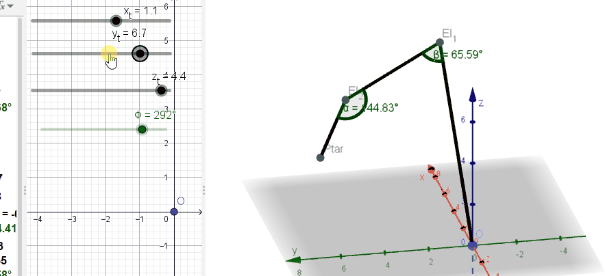

# Hi there 👋, I'm Fathur (ファツル)
### Student | Computer Enggineering | UNAND

### I'm a Computer engineering Student, who likes to learn something new, especially science and technology related.
#
- I’m currently learning About Kinematics and Robotic.
- Currently learning 4-dof (4 degree of Freedom) robots.
- Simulating the robots using Geogebra
- Aiming to make a robot that can controlled with hands.
- Know C basics programming.
- Likes to integrates math with programming
- 日本語を勉強しています
- 日本でインターンシップをしたいです

よろしくお願いします
<!--
**FathurFauzi/FathurFauzi** is a ✨ _special_ ✨ repository because its `README.md` (this file) appears on your GitHub profile.

Here are some ideas to get you started:

- 🔭 I’m currently working on ...
- 🌱 I’m currently learning ...
- 👯 I’m looking to collaborate on ...
- 🤔 I’m looking for help with ...
- 💬 Ask me about ...
- 📫 How to reach me: ...
- 😄 Pronouns: ...
- ⚡ Fun fact: ...
-->
